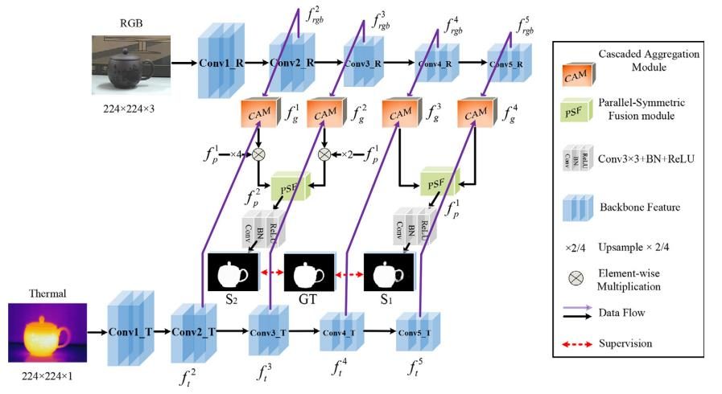
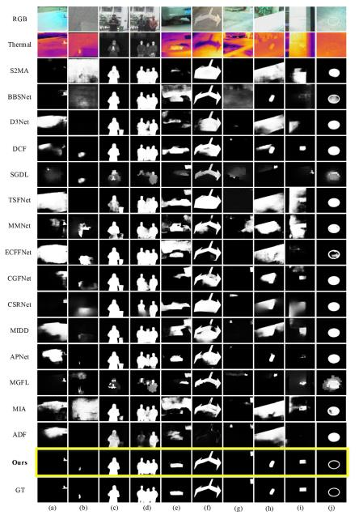
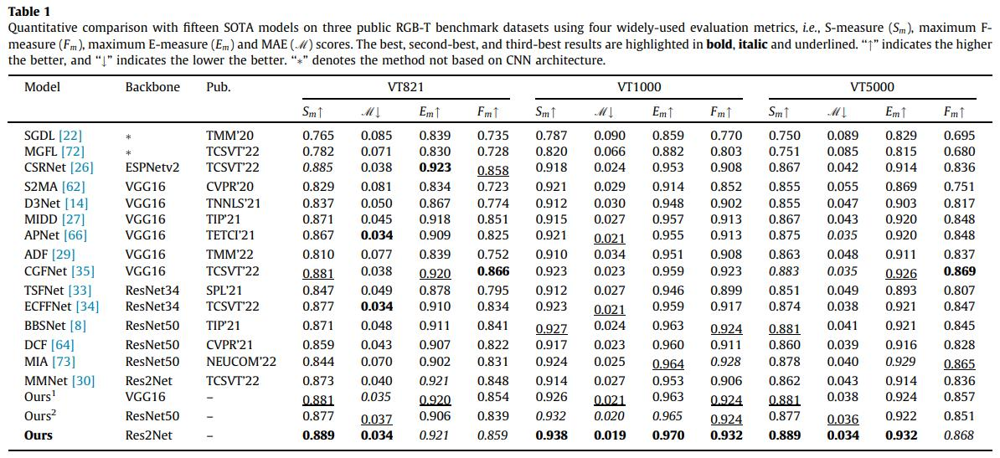

# PSNet:Parallel symmetric network for RGB-T salient object detection  

  
   Figure.1 The overall architecture of the proposed PSNet model.  
   Published in Neurocomputing [paper](https://pan.baidu.com/s/1V7DPu68B7uDzSHnTSE4h2g)[code:NEPU]
  
# 1.Requirements
Python v3.6, Pytorch 0.4.0+, Cuda 10.0, TensorboardX 2.0, opencv-python

# 2.Data Preparation
Download the raw data from [here](https://pan.baidu.com/s/1JtnzmNVp-W-68pwscQYM3g)[code:NEPU]. Then put them under the following directory:  

    -Dataset\   
       -train\  
       -test\  
       -test_in_train\
       
# 3.Training & Testing
* **Training the PSNet**  
  
    run python Train.py  

* **Testing the PSNet**  

Please download the [model parameters](https://pan.baidu.com/s/11zsL2vBhCbNIa7X9QDG5Hw)[code:NEPU]  

    run python Test.py  

Then the test maps will be saved to './Salmaps/'

* **Evaluate the result maps**  

You can evaluate the result maps using the tool from [here](https://pan.baidu.com/s/1gmckcn7FZuDP2ufiTM6qow)[code:NEPU], thanks for [Dengpin Fan](https://github.com/DengPingFan).

# 4.Results
# 4.1 Qualitative Comparison  
  
Figure.2 Qualitative comparison of our proposed method with fifteen SOTA methods. 

  
Table.1 Quantitative comparison with fifteen SOTA models on three public RGB-T benchmark datasets.  

# 4.3 Download  
The salmaps of the above datasets (Res2Net backbone) can be download from [here](https://pan.baidu.com/s/185hCBeczOtFbBdJoC_FcEQ) [code:NEPU]  
The salmaps of the above datasets (VGG16 backbone) can be download from [here](https://pan.baidu.com/s/11ibTBy0VUE17Lp5FxsNd9w) [code:NEPU]  
The salmaps of the above datasets (Swintransformer backbone) can be download from [here](https://pan.baidu.com/s/1_uY9a8cEBfPoIRAZD7Xvwg) [code:NEPU]  
The salmaps of the RGBD datasets (Res2Net backbone) can be download from [here](https://pan.baidu.com/s/1Pn6gtJ7-4ma4HgB90JPGGw) [code:NEPU]

# 5.Citation  
@article{BI2022410,  
title = {PSNet: Parallel symmetric network for RGB-T salient object detection},  
author = {Hongbo Bi and Ranwan Wu and Ziqi Liu and Jiayuan Zhang and Cong Zhang and Tian-Zhu Xiang and Xiufang Wang},  
journal = {Neurocomputing},  
volume = {511},  
pages = {410-425},  
year = {2022},  
issn = {0925-2312},  
doi = {https://doi.org/10.1016/j.neucom.2022.09.052},  
url = {https://www.sciencedirect.com/science/article/pii/S0925231222011559},  
}  

# 6.Contact  
If you have any questions, feel free to contact us via tianzhu.xiang19@gmail.com (T.-Z. Xiang) or wuranwan2020@sina.com (Ranwan Wu).
 
